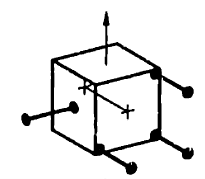
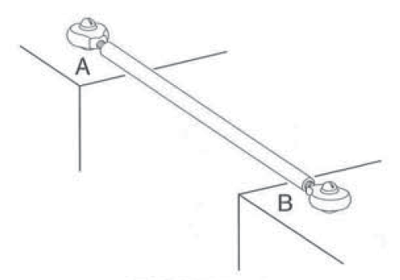
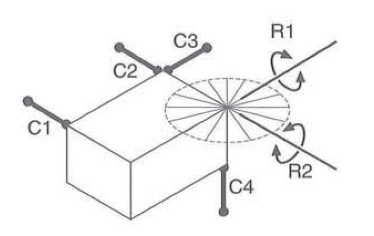
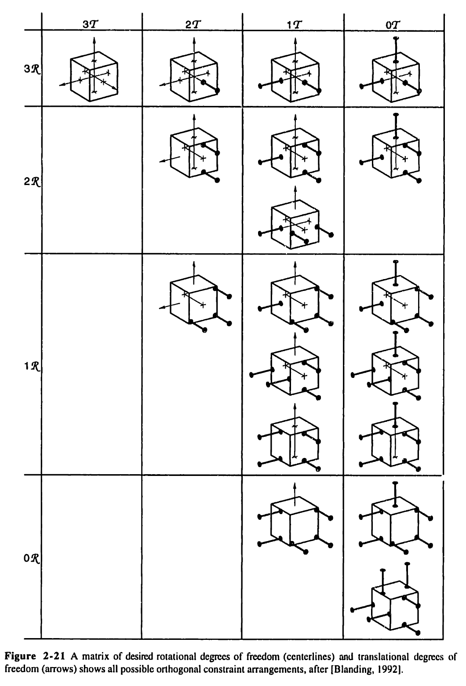
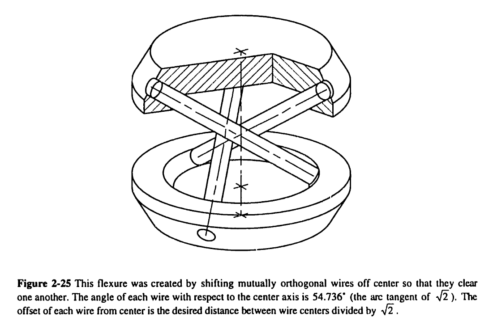

# Kinematic Constraint


Solve for rigid body degrees of freedom with the theory of kinematic constraint (aka exact constraint).

For example, the cube below is connected to four constraints (show by thick black lines with dots).
This body has one translational degree of freedom along $z$ (shown by a thin arrow),
and one rotational degree of freedom around $x$ (shown by a thin axis with "+" marks)



This python script calculates and visualizes its degrees of freedom:

```pycon
>>> from matplotlib import pyplot as plt
>>> from kinematic_constraint import Constraint, calc_dofs_basis, draw
>>> constraints = [
...     Constraint(point=(1, 1, 1), direction=(-1, 0, 0)),
...     Constraint(point=(1, 1, -1), direction=(-1, 0, 0)),
...     Constraint(point=(1, -1, -1), direction=(-1, 0, 0)),
...     Constraint(point=(0, -1, 0), direction=(0, 1, 0)),
... ]
>>> dofs = calc_dofs_basis(constraints)
>>> for dof in dofs:
...     print(dof)
DoF(translation=None, rotation=Rotation(point=(-0.0, 0.0, -0.0), direction=(-1.0, 0.0, 0.0)), pitch=None)
DoF(translation=(0.0, 0.0, 1.0), rotation=None, pitch=None)

>>> draw(constraints, dofs)  # doctest: +ELLIPSIS
<Figure ... with 4 Axes>
>>> plt.show()  # doctest: +SKIP

```

## Motivation

The theory of exact constraint is a powerful tool for the design of precision machines / mechanisms.
However, it can be difficult to apply.
Blanding 1999 and Hale 1999 (see [references](#references)) describe a geometric / pictorial method for determining
the degrees of freedom from the applied constraints
(e.g. "The axes of a body's rotational degrees of freedom will each intersect all constraints applied to the body").
This "think real hard about the line diagram" approach is difficult to apply,
particularly for complicated arrangements of non-orthogonal constraints.
Missing a degree of freedom at the design stage may not be noticed until the mechanism is built (and doesn't work), and thus can have expensive consequences
(the author has done this once or twice 😰).

This software can automatically detect the degrees of freedom, and visualize them,
with only a few lines of python.
Hopefully, this makes the method of exact constraint easier to use in mechanical design.

## Core concepts

*Single rigid body* - This software models the motion of a single rigid body. However, the body may be supported via flexible elements like wires or [flexures](https://en.wikipedia.org/wiki/Flexure), which are modeled as constraints.

*Constraint* - An ideal constraint line connects to a rigid body at a point,
and prevents the connection point from moving along the direction of the constraint.
This definition of a constraint is from Section 1.3 of Blanding 1999
(see [references](#references)).
An example realization of an ideal constraint would be a rod with ball joints on both ends, as in the figure below.
Some connections like a ball-in-groove or a sheet flexure are modeled with multiple constraints; see Blanding 1999 to learn more.



*Degree of freedom* - A degree of freedom is a direction of translation, or a line of rotation, about which the body can make small motions without compressing or extending any constraint.

*Non-unique degrees of freedom* - In some cases, a body can be free to rotate or translate about an infinite "sub-space" of directions.
For example, the body in the figure below is free to rotate about any line in
the horizontal plane which passes through its top-right corner.
See Blanding 1999 Chapter 3 for further examples of non-unique degrees of freedom.



*Degree of freedom basis* - This software uses a degree-of-freedom [basis](https://en.wikipedia.org/wiki/Basis_(linear_algebra))
to represent the space of degrees-of-freedom allowed by a constraint set.
For example, in the above figure, the body has a degree-of-freedom space of dimension 2,
and the rotations R1 and R2 are the space's basis vectors.
Any linear combination of R1 and R2 is also an allowed rotation,
e.g. rotation about any of the disk of thin lines drawn in the figure.

Use the function `calc_dofs_basis(constraints)` to calculate the degree of freedom basis.

Use the function `constraints_allow_dof(constraints, dof)` to check if a set of constraints allows a particular degree of freedom.

## How it works

The degrees of freedom are calculated from the null space of a constraint matrix, as described in [math.md](math.md).

The algorithm is tested on every example from Figure 2-21 of Hale 1999 (see `test_hale_2_21` in `tests/test_dof.py`):



The algorithm also handles constraint sets with helical degrees of freedom,
like this arrangement from Figure 2-25 of Hale 1999:



The python snippet below creates the arrangement of three skew constraints from the figure
(but with an angle to the z axis of 45 degrees). It then checks that these constraints
allow a helical rotation and translation about the $z$ axis with a pitch of 0.1 length units per radian.

```pycon
>>> import numpy as np
>>> from kinematic_constraint import Constraint, DoF, Rotation, constraints_allow_dof
>>> x0 = 1.0; y0 = 0.1
>>> constraints = []
>>> for theta in [0.0, 2 / 3 * np.pi, 4 / 3 * np.pi]:
...     constraints.append(
...         Constraint(
...             point=(
...                 x0 * np.cos(theta) - y0 * np.sin(theta),
...                 x0 * np.sin(theta) + y0 * np.cos(theta),
...                 0,
...             ),
...             direction=(np.cos(theta), np.sin(theta), 1),
...         )
...     )
>>> constraints_allow_dof(
...     constraints,
...     DoF(translation=(0, 0, 1), rotation=Rotation((0, 0, 0), (0, 0, 1)), pitch=0.1),
... )
True

```

## References

[1] D. Blanding, Exact Constraint: Machine Design Using Kinematic Processing.
New York: American Society of Mechanical Engineers, 1999.

[2] Layton C. Hale, "Principles and techniques for designing precision machines,"
Thesis, Massachusetts Institute of Technology, 1999. Accessed: Jun. 28, 2022.
[Online]. Available: https://dspace.mit.edu/handle/1721.1/9414

